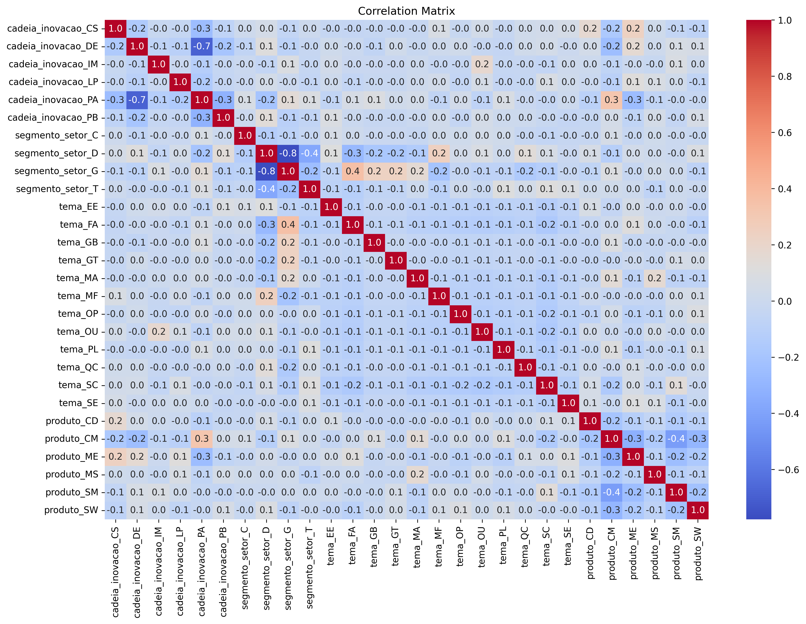

# 🧠 Treinamento do Modelo de Classificação

Este módulo realiza todo o pipeline de preparação, balanceamento, treinamento e avaliação de um modelo de classificação de projetos da ANEEL com scikit-learn.

## ⚙️ Funcionalidades

- Leitura dos dados da base SQLite
- Limpeza, normalização e one-hot encoding
- Balanceamento com undersampling
- GridSearchCV com RandomForestClassifier
- Avaliação com matriz de confusão e métricas
- Salvamento do modelo em `.pkl`

## 📁 Estrutura

```bash
treinamento_modelo/
├── scripts                     # Funções auxiliares
│   ├── feature_engineering.py  # Pipeline de processamento de dados
│   └── model_train_eval.py     # Treinamento e avaliação
└── main.py                     # Script principal
```

## 📊 Desempenho do Modelo (Dados de Teste)

### Métricas Globais

| Métrica                | Valor   |
|------------------------|---------|
| Acurácia               | 0.7709  |
| Precisão (ponderado)   | 0.7751  |
| Recall (ponderado)     | 0.7709  |
| F1 Score (ponderado)   | 0.7711  |
| AUC-ROC                | 0.7732  |

### Matriz de Confusão

| Real \ Previsto | Sucesso | Falha |
|-----------------|---------|-------|
| **Sucesso**     |    70   |   25  |
| **Falha**       |    16   |   68  |


### Matriz de Correlação



#### As métricas estão salvas na pasta assets.

## 🛠️ Como Executar

```python
python main.py
```

## Requisitos

```bash
pip install pandas scikit-learn joblib seaborn matplotlib
```